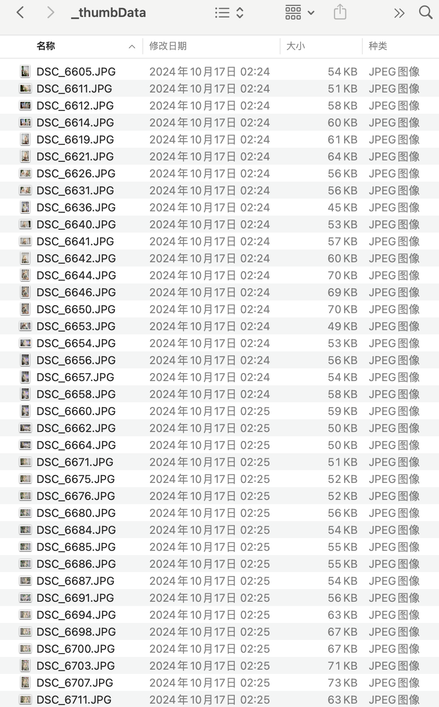

<a href="https://flutter.dev/">
  <h1 align="center">
    <picture>
      <source media="(prefers-color-scheme: dark)" srcset="https://storage.googleapis.com/cms-storage-bucket/6e19fee6b47b36ca613f.png">
      
    </picture>
  </h1>
</a>

# yubi_image_manager

目前仅支持Mac端，不知道取什么名字好呢

## 运行

```
cd image_manager
flutter pub get
flutter run
```

## 仅体验

下载`image_manager.zip`然后解压缩后直接打开。

## 使用的库

```yaml
  cupertino_icons: ^1.0.6 # ios图标
  file_picker: ^5.2.0  # 文件选择插件
  photo_view: ^0.14.0  # 用于图片预览
  exif: ^2.0.1 # 拍摄照片信息
  path: ^1.8.0 # 路径工具
  flutter_riverpod: ^2.0.0  # 状态管理工具
  shared_preferences: ^2.0.0 # 数据持久化工具
```

## 版本

### v1.0

大致功能完成。

- [演示视频一](https://www.bilibili.com/video/BV1LTxxesEkY/) 选择文件夹，关闭文件夹，查看图片，新增相册，收藏，设置封面
- [演示视频二](https://www.bilibili.com/video/BV1e3xxeQEku/) 图片收藏标识，收藏图片后按相册导出
- [演示视频三](https://www.bilibili.com/video/BV1V3xxeQE2M/) 设置页响应式布局，创建相册，修改相册


### v1.1

- [演示视频](https://www.bilibili.com/video/BV1nCxteBEXz/) 新增文件夹历史卡片，整理了一下目录结构

### v1.2

> 在使用过程中发现图片太大了，导致了内存占满，然后图片加载很慢。

增加照片缓存功能，生成较小的缩略图到本地，极大提高了预览时图库的加载速度。
使用了 flutter_image_compress 进行图片压缩，在打开文件夹或者设置页可以缓存。

- [演示视频]() 演示了一下有缓存和没缓存的加载速度差异，设置页里面增加缓存项。

后续再加一下后台缓存逻辑，实际上就是自动生成较小的微缩图进行切换。

